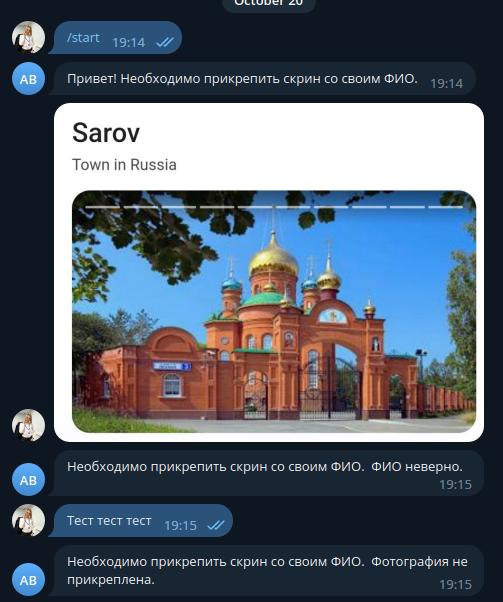
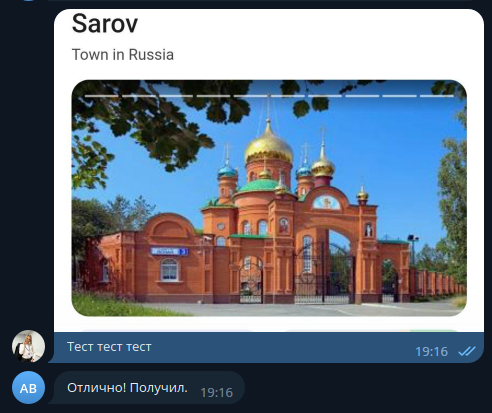
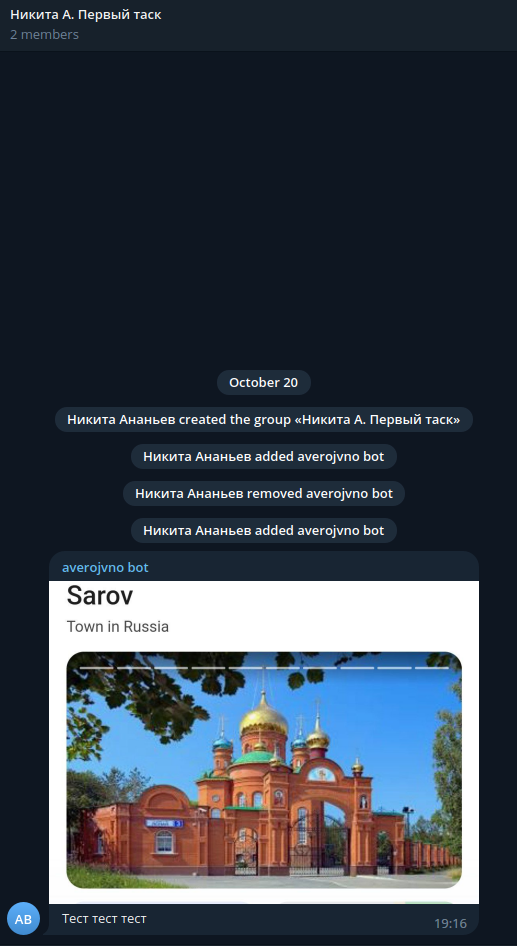

# Чат бот для получения и пересылки данных в некоторый чат

_Сделал [Ananev Nikita](https://t.me/coma8765)_

> Решение первой тестовой задачи от BWG,
> согласно [техническому заданию](docs/TASK.md)

## Использование

### Docker Compose

_Скопируйте [`.env.example`](.env.example) в `.env.docker` и заполните его._

```shell
docker compose up -d  # Equal "make up" 
```

## Тестирование

### Unit-tests

Частично [реализованно тестирование адаптера библиотеки телеграмм API](src/test/test_adapters/test_aiogram.py)

### Фотоотчёт



